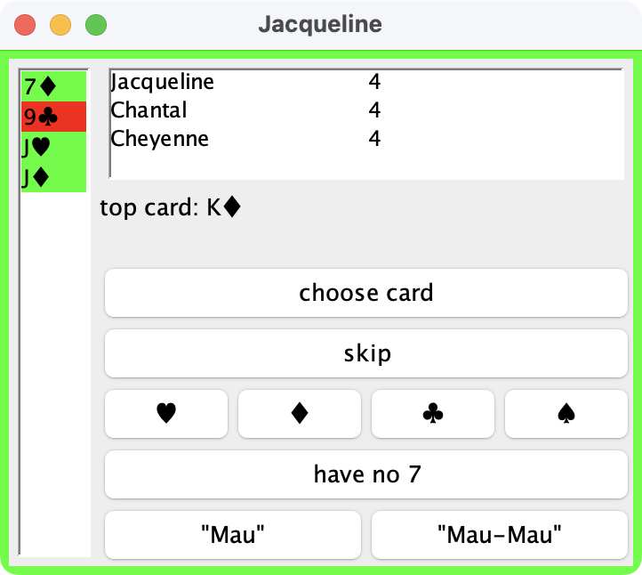
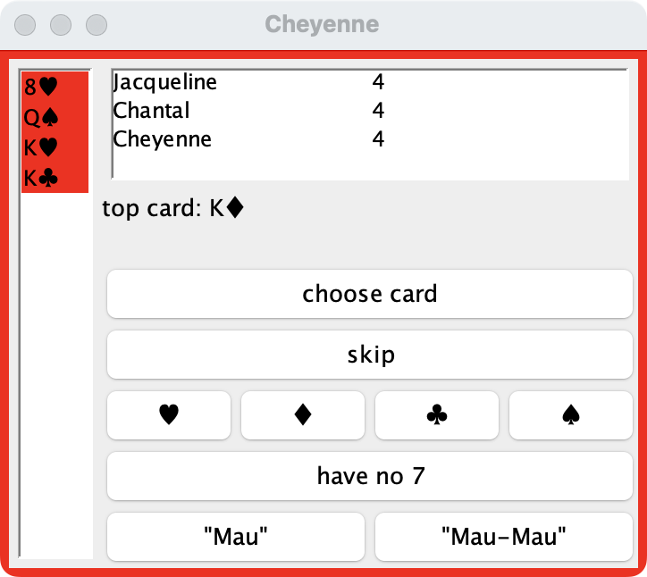
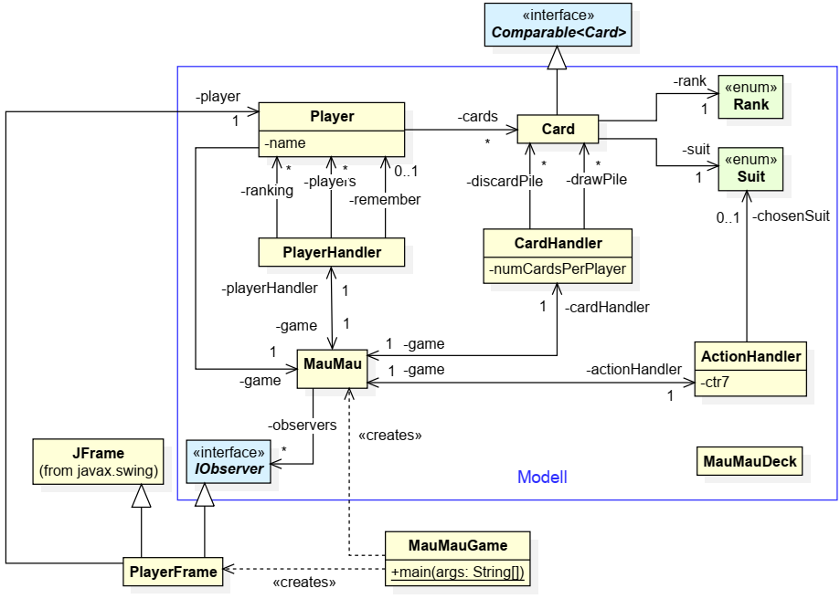
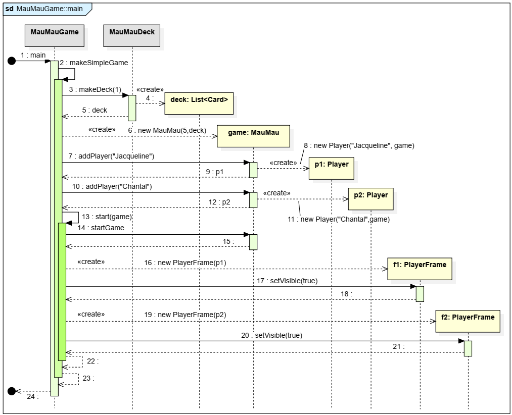
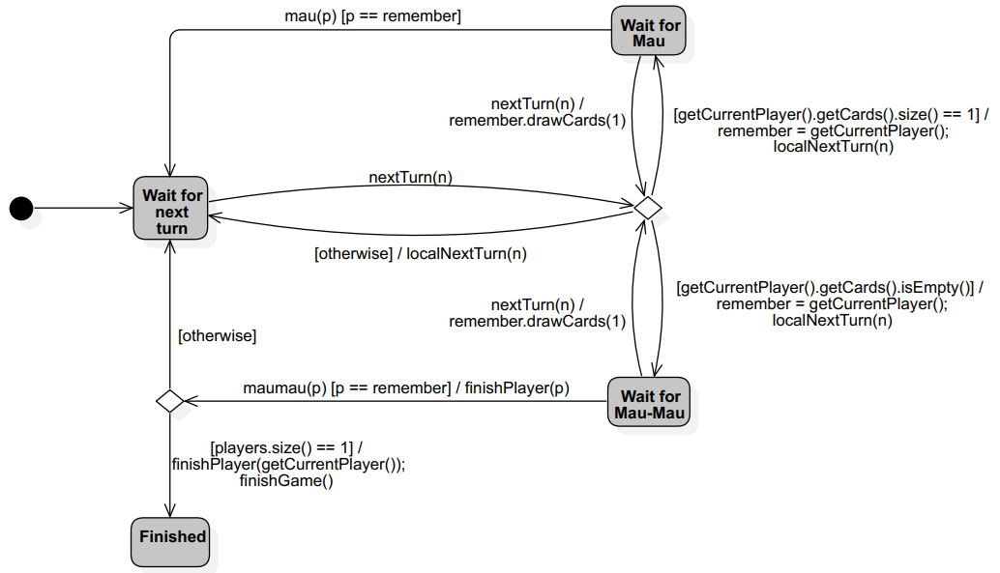
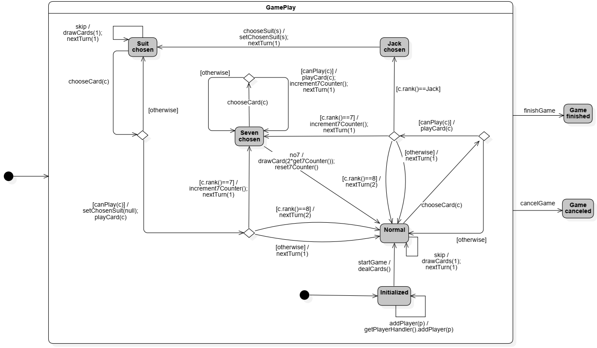

# Mau-Mau

Ziel: Realisierung der Spielmechanik von Mau-Mau

## 1 Einleitung

[Spielregeln](https://de.wikipedia.org/wiki/Mau-Mau_(Kartenspiel))

Spiel mit Skatblatt, also französische Karten mit Werten: 7, 8, 9, Bube, König und Ass

auch: mehrere Skatblätter für eine **große** Zahl von Spielern (alle Karten können mehrfach vorkommen)

Sonderkarten: 7 ("Zwei-Ziehen"), 8 ("Aussetzen"), Bube ("Wunsch/Allesleger") <br> 
**Verboten:** Bube auf Bube!

Spielanfang: <br>
Wie viele Skatblätter? Wie viele Karten für jeden Spieler? <br>
Dann, alle Karten mischen und jeder Spieler bekommt die festgelegte Anzahl an Karten. <br>
Eine der verbleibenden Karten wird offen aufgedeckt und bildet den Anfang des Ablagestapels. <br>
Diese Karte wurde von keinem Spieler abgelegt, damit hat diese keine Sonderfunktion, <br>
d. h. 7, 8 und Bube werden als ganz "normale" Karten gewertet. <br>
Die restlichen Karten bilden den Zugstapel. 

Dann sind die Spieler reihum am Zug. <br>
Wenn eine Spieler keine Karte ablegen kann oder will, muss er eine Karte vom Zugstapel nehmen. <br>
Wenn eine Spieler seine vorletzte Karte ablegt, muss er "Mau" sagen, bei seiner letzten Karte "Mau-Mau". <br>
Vergisst er das, muss er eine Karte vom Zugstapel aufnehmen. <br>
Ist der Zugstapel komplett aufgebraucht, werden die Karten des Ablagestapels - mit Ausnahme der obersten Karte - 
neu gemischt und anschließend als Zugstapel verwendet.

Es gewinnt der Spieler, der als erstes alle seine Karten abgelegt hat. <br>
Die verbleibenden Spieler spielen weiter, bis der "zweite Sieger" feststeht, und so weiter. <br>
Das Spiel endet, wenn der vorletzte Spieler alle seine Karten abgelegt hat und nur noch ein Spieler Karten 
auf der Hand hat. <br>
Das ist dann der "letzte Sieger".

---

## 2 GUI

Gegeben: rudimentäre GUI (kein Fokus auf UI/UX)

Beispiel mit vollständiger Spielmechanik und Spiel mit drei Spielern (Jacqueline, Chantal und Cheyenne)





Für ein besseres Spielerlebnis, **wäre** es notwendig, das Spiel auf unterschiedliche Rechnern spielen zu können,
die über das Netzwerk kommunizieren. <br>
Hier: alle Spieler eines Spiels spielen gemeinsam auf einem Rechner. <br>
Die drei Fenster erscheinen daher alle gleichzeitig auf dem eigenen Bildschirm, und man muss reihum die Rollen von 
Jacqueline, Chantal und Cheyenne übernehmen.

Bedienung der GUI (daraus folgen die Anforderungen an die Spielmechanik): <br>
Gestartet wird ein Spiel mit der vorgegebenen Klasse `cards.maumau.MauMauGame`. <br>
Als Kommandozeilenparameter ist anzugeben, wie viele Karten jeder Spieler zu Anfang erhälten und wie viele Skatblätter 
verwendet werden sollen. Außerdem sind die Namen der teilnehmenden Spieler anzugeben. <br>
In diesem Fall erhält jeder Spieler vier Karten, es wird mit einem Skatblatt gespielt, und es spielen Jacqueline, 
Chantal und  Cheyenne. Die Kommandozeilenparameter sind daher: `4 1 Jacqueline Chantal Cheyenne`.

Das Programm zeigt dann für jeden Mitspieler ein eigenes Fenster. <br>
Die Reihenfolge der Spieler ist in jedem Fenster in einer Tabelle rechts oben zu sehen, zusammen mit der Information,
wie viele Karten jeder Mitspieler noch auf der Hand hat. <br>
An der Reihe ist jeweils der erstgenannte Spieler, d.h. der Tabelleninhalt ändert sich mit fortlaufendem Spiel ständig. <br>
Zusätzlich gibt der grüne Fensterrahmen an, wer an der Reihe ist; alle anderen Fenster haben einen roten Rahmen.

Unterhalb der Tabelle mit den Namen der Spieler wird die oberste Karte das Ablagestapels
angezeigt, hier der Karo-König. <br>
Jeweils links ist das Blatt des jeweiligen Spieler zu sehen. <br>
Grün hinterlegt sind die Karten, die gespielt werden können; das sind hier die Karo-Sieben und die  beiden Buben, 
die auf jede Karte außer einen gespielten Buben passen. <br>
Jacqueline spielt eine  dieser Karten, indem sie sie mit der Maus auswählt und anschließend den Knopf *choose card*
betätigt. <br>
Ist bei Betätigung dieses Knopfes eine unzulässige Karte ausgewählt (hier die Kreuz-Neun), soll nichts passieren. <br>
Wenn man keine Karte legen kann (dann sind sie alle rot hinterlegt) oder will, betätigt man den Knopf *skip*, 
wodurch der Spieler automatisch eine zusätzliche Karte vom Zugstapel erhält. <br>
Die vier Knöpfe mit den Farben ♣, ♦, ♥ und ♠ benötigt man zur Wahl der entsprechenden Farbe: Spielt man einen Buben, 
muss man unmittelbar danach den der gewunschten Farbe entsprechenden Knopf betätigen.

Die drei restlichen Knöpfe haben die folgende Bedeutung:
- *have no 7* betätigt ein Spieler, wenn eine Sieben auf den Ablagestapel gelegt wurde und er selbst keine Sieben spielen 
kann oder will. <br>
Dann erhält er doppelt so viele Karten vom Zugstapel, wie zuvor Siebener in Folge abgelegt worden waren. <br>
Deren Zahl wird im Fenster unmittelbar oberhalb des Knopfes *choose card* angezeigt. <br>
Oben nichts angezeigt, weil keine Sieben abgelegt wurden.
- Die Taste "*Mau*" bzw. "*Mau-Mau*" muss ein Spieler betätigen, wenn er sein vorletzte bzw. letzte Karte abgelegt hat.<br>
Zur Strafe erhält er eine Karte vom Zugstapel, wenn er das vergisst und nicht die entsprechende Taste betätigt, 
bevor der nächste Spieler seinen Spielzug beendet hat.

Ein Spieler, der alle seine Karten abgelegt hat, erscheint nicht mehr in der Tabelle der aktuellen Spieler rechts 
oben in jedem Fenster, sein Fenster bleibt aber sichtbar; das Spiel läuft dann  mit den verbleibenden Spielern weiter. <br>
Wenn nur noch ein Spieler verbleibt, wird in der Tabelle die Rangfolge der Sieger dargestellt; 
dann ist kein Spieler mehr an der Reihe, d.h. alle Fenster haben einen roten Rahmen.

Den Programmcode zur GUI, den Spielkarten und der Klasse `cards.maumau.MauMauGame` ist gegeben. <br>
Es fehlt also noch die Realisierung des gesamten Verhaltens, das man unter Nutzung der GUI auslöst und das den 
obigen Erläuterungen zugrunde liegt. <br>
Im Folgenden ist dieses Verhalten mit **Zustandsautomaten** spezifiziert, die Sie zur Realisierung des geforderten 
Verhaltens implementieren sollen. <br>
Zuvor gehen wir aber auf die zugrunde liegende Struktur ein.

 <br>
Klassendiagramm des Mau-Mau-Programms (MVC-Pattern) <br>
meisten Attribute und Methoden fehlen aus Gründen der Übersichtlichkeit <br>
ausserhalb vom Model-Block: Klassen gehören zu View und Controller <br>
JFrame und Comparable aus der Java API

Im Folgenden besprechen wir schrittweise ihre Aufgaben und Funktionen. <br>
Zwischen die Erläuterungen sind jeweils Aufgaben eingestreut, in denen Sie noch fehlende Methoden und ggf. weitere 
Klassen realisieren sollen. <br>
Schritt fur Schritt sollen so jeweils mehr Testfälle erfolgreich durchlaufen, bis Ihr Code am Schluss alle Testfälle 
erfüllt und Sie das Spiel ausführen können.

---

## 3 `Card`, `Rank` und `Suit`

Spielkarten werden mit dem Record `Card` und den Aufzählungstypen `Rank` und `Suit` realisiert. <br>
`Suit` repräsentiert die Farben ♥, ♦, ♣ und ♠ mit den englischen Bezeichnungen *Hearts*, *Diamonds*, *Clubs* und *Spades*, <br>
der Aufzählungstyp `Rank` die Zahlenkartenwerte *2, 3, ..., 9, 10*, außerdem Bube, Dame, König und Ass, abgekürzt *J, Q, K, A* 
für die englischen Bezeichnungen *Jack*, *Queen*, *King* und *Ace*. <br>
Der Record `Card` bildet einfach Paare von `Rank` und `Suit`.

Erläuterung von Records: <br>
Seit Java 16 werden in Java auch sog. **Datenklassen** unterstützt. <br>
Ihr Zweck ist es, Daten in **unveränderlichen Objekten** zu halten und dem Programmierer Schreibarbeit zu sparen. <br>
Ein sog. *kanonischer Konstruktor* steht ebenso automatisch zur Verfügung wie Getter-Methoden fur die Attribute 
sowie kanonische `equals`-, `hashCode`- und `toString`-Methoden. <br>
Die Getter-Methode von `Card` sind demnach `rank` und `suit`.

`Card` implementiert das Interface `Comparable<Card>` und damit eine lineare Ordnung auf ihnen. <br>
Die Karten der Spieler werden sortiert dargestellt. (siehe oben GUI)
Hierfür ist der Methodenaufruf `sorted()` in der `updateCardList`-Methode von `PlayerFrame` zuständig. <br>
Wie  man der API-Dokumentation von `sorted()` entnehmen kann, muss `Card` dazu das `Comparable`-Interface und 
daher die `compareTo`-Methode implementieren.

### Aufgabe 1 (Spielkarten)

a) <br> Implementieren Sie in den Aufzählungstypen `Rank` und `Suit` die `toString`-Methode, so dass sie für `Rank`-Instanzen
nicht "`TWO`", "`THREE`" usf., sondern *2, 3, 4, ..., J, Q, K, A*, und für `Suit`-Instanzen ♥, ♦, ♣ bzw. ♠ zurückgeben. <br>
Beachten Sie hier die beiden Testklassen `RankTest` und `SuitTest`.

b) <br> Implementieren Sie die `compareTo`-Methode im Record `Card`, so dass sie eine lexikographische Ordnung 
zuerst auf dem `Rank`- und anschließend auf dem `Suit`-Wert realisieren. <br>
`Ranks` seien hier gemäß 2 < 3 < 4 < 5 < 6 < 7 < 8 < 9 < 10 < J < Q < K < A und <br>
`Suits` gemäß ♥ < ♦ < ♣ < ♠ sortiert, so dass sich auf Spielkarten die folgen de Ordnung ergibt: <br>
2♥ < 2♦ < 2♣ < 2♠ < 3♥ < 3♦ < 3♣ < 3♠ < ... A♥ < A♦ < A♣ < A♠. <br>
Lesen Sie dazu die API-Dokumentation zur `compareTo`-Methode im Interface `Comparable`. <br>
Beachten Sie ferner, dass alle Aufzählungstypen, und damit auch `Rank` und `Suit`, automatisch das `Comparable`-Interface 
implementieren! <br>
Beachten Sie hier die Testklasse `CardTest`.

c) <br> Implementieren Sie nun die Methode `makeDeck` der Klasse `MauMauDeck`. <br>
Der übergebene Parameter gibt an, wie viele Skatblätter verwendet werden. <br>
Die Methode soll eine Liste aller Karten der entsprechenden Zahl an Skatblättern gemischt zuruckgeben, 
die man für Mau-Mau braucht. <br>
Beachten Sie, dass bei Mau-Mau die Karten mit Rank 2, 3, 4, 5 und 6 nicht verwendet werden. <br>
Zum Mischen der Karten können Sie die Methode `shuffle()` der Klasse `java.util.Collections` verwenden. <br>
Beachten Sie hier die Testklasse `MauMauDeckTest`.

---

## 4 `MauMauGame`

Wenn man MauMauGame ohne Kommandozeilenparameter startet, dann wird mittels seiner (statischen) Methode `makeSimpleGame`
ein einfaches Spiel mit einem Skatblatt und den zwei Spielerinnen Jacqueline und Chantal, die beide anfangs je fünf 
Karten auf die Hand bekommen, gestartet.

 <br>
Ablauf als Sequenzdiagramm:

- Dazu ruft `makeSimpleGame` die statische Methode `makeDeck(1)` vom `MauMauDeck` auf (Nachricht 3), 
die eine gemischte Liste von Spielkarten eines Skatblatts zuruckgibt. (Methode aus Aufgabe 2)
- Mit Nachricht 6 wird eine Instanz der Klasse `MauMau` mit dieser Liste als Kartenstapel und der Anzahl anfänglich
den Spielen auszuteilenden Karten (hier fünf) erzeugt. <br>
Mit den folgenden Methodenaufrufen werden `Player`-Instanzen fur die beiden Mitspielern erzeugt. <br>
Dabei wird jeweils auch die `addPlayer`-Methoden im `ActionHandler` aufgerufen. Sie sind im Sequenzdiagramm weggelassen.
- Anschließend wird mit Nachricht 14 das Spiel gestartet. <br>
Die `startGame`-Methode von `MauMau` wird den Spielern jeweils fünf Karten geben, das ist im Sequenzdiagramm aber ebenfalls
nicht dargestellt, weil Sie das im Zuge der Realisierung der Klasse `ActionHandler` umsetzen sollen (Aufgabe 4). <br>
Zuletzt wird für jeden Mitspieler ein Fenster als Instanz von `PlayerFrame` erzeugt und mittels `setVisible` auf dem 
Bildschirm dargestellt.
- Die `main`-Methode von `MauMauGame` endet mit Nachricht 24. <br>
Das laufende Programm terminiert aber nicht, da die Fenster der beiden Spielerinnen aktiv sind und Nutzerinteraktionen
ermöglichen. <br>
Das Spiel funktioniert nun in ähnlicher Weise, wie Programme mit graphischer Benutzerschnittstelle 
im Vorlesungskapitel 8 besprochen worden sind: <br>
Das Betätigen eines Knopfes in einem der Fenster führt dazu, dass vom zugehörigen `Player`-Objekt die zugehörige Methode
ausgeführt wird. <br>
Drückt man beispielsweise den Knopf "*Mau*" in Jacquelines Fenster, dann wird die Methode `mau()` des Objekts `p1` ausgeführt 
(Suchen Sie den entsprechenden Programmcode in der Klasse `PlayerFrame`). <br>
Andererseits werden die `PlayerFrame`-Objekte, die das `IObserver`-Interface implementieren, unter Nutzung des
`Observer`-Musters (siehe Vorlesungskapitel 8) über jede Anderung des Modells benachrichtigt. <br>
Inspizieren Sie dazu die `update`-Methode der Klasse `PlayerFrame`. <br>
Diese Methode wird (über das `IObserver`-Interface) immer dann vom `MauMau`-Objekt aufgerufen, wenn die Darstellung 
im Fenster an das geänderte Modell angepasst werden muss.

---

## 5 `IObserver`

Iterace `IObserver`:
```java
/**
* Interface for observing changes in the Mau-Mau game.
*/
public interface IObserver {
    /**
    * Method called to notify the observer of a general update in the game.
    */
    void update();

    /**
    * Method called to send a message to the observer.
    *
    * @param msg The message to be sent.
    */
    void message(String msg);
}
```

Die `update`-Methode muss bei jeder Änderung im Modell aufgerufen werden, die `message`-Methode führt in ihrer Implementierung 
in `PlayerFrame` dagegen dazu, dass die übergebene Zeichenkette bei jedem Spieler als Dialog angezeigt wird und von 
ihr bestätigt werden muss. <br>
Beispielsweise kann man diese Methode nutzen, um alle darüber zu informieren, dass ein Spieler Mau-Mau zu sagen vergessen hat.

---

## 6 `Player` und `MauMau`

Die Klassen `Player` und `MauMau` sind vollständig vorgegeben. <br>
Ihre Methoden werden von der GUI  in `PlayerFrame` aufgerufen, wenn man beispielsweise einen Knopf betätigt. <br>
Der jeweilige Zweck der Methoden und die gegebenenfalls zugehörigen Parameter sowie Rückgabewerte sollten sich
aus den JavaDoc-Kommentaren erschließen.

Beide Klassen stellen die Facade des Modells (im Sine des MVC-Musters) dar, um einzelne Spieler und das Spiel als 
ganzes zu repräsentieren. <br>
`PlayerFrame` verwaltet die Karten, die der Spieler auf der Hand hält, weitere Zustandsattribute und 
konkrete Funktionalität stellen beide Klassen aber nicht zur Verfugung. <br>
Vielmehr dienen sie als Facade für das ganze Modell und delegieren die meisten Methodenaufrufe an Instanzen 
der Klassen `PlayerHandler`, `CardHandler` sowie `ActionHandler`, auf die die folgenden Abschnitte eingehen. <br>
Es wäre durchaus möglich, auf diese drei Klassen zu verzichten und ihre Funktionen komplett in MauMau zu 
realisieren, das wurde aber diese Klasse überfrachten und dem Entwurfsprinzip widersprechen, 
dass Klassen nur einem einzigen Zweck dienen sollen, wodurch der objektorientierte Entwurf schwerer
verständlich und schlechter zu warten wäre.

*Single responsibility principle*: <br>
"A class should have one and only one reason to change, meaning that a class should have only one job."

---

## 7 `CardHandler`

`CardHandler` verwaltet die Spielkarten, die von keinem Spieler auf der Hand gehalten werden  und daher 
entweder auf dem Ablage- oder dem Zugstapel liegen. <br>
Die beiden Stapel sind als `LinkedList`-Attribute realisiert. <br>
Die Klasse stellt ferner Methoden bereit, um Karten auf dem Ablagestapel abzulegen 
(`discardCard`, die von der Methode `playCard` von `Player` genutzt wird), und eine Karte vom Zugstapel 
aufzunehmen (`drawCard`).

Die letztgenannte Methode kümmert sich auch um die Situation, wenn der Zugstapel leergezogen wurde. 
In diesem Fall werden mit Ausnahme der obersten alle Karten des Ablagestapels als Zugstapel wiederverwendet 
(Methode `reuseDiscardedCards`). <br>
Natürlich werden die Karten zuvor gemischt. <br>
Außerdem kümmert sich die Methode auch um den Fall, dass die Zahl der Karten nicht mehr ausreicht, weil der 
Zugstapel leer ist und der Ablagestapel nur noch aus der obersten Karte besteht. <br>
In diesem Fall muss das Spiel abgebrochen werden, realisiert durch den Methodenaufruf
`game.getActionHandler().cancelGame();` in `drawCard`. <br>
Die Methode `cancelGame` wird in `ActionHandler` realisiert. <br>
Sie ist außerdem ein
Beispiel für das *single responsibility principle*: `CardHandler` ist für die Verwaltung der Spielkarten
verantwortlich, aber eben nicht für den Spielablauf, wofür wiederum `ActionHandler` zuständig ist.

### Aufgabe 2 (CardHandler)
Ergänzen Sie die Implementierung der Methode `dealCards`, die in der Klasse `CardHandler` noch fehlt. <br>
Ihre Aufgabe besteht darin, allen Mitspielern reihum nacheinander jeweils eine Karte vom Zugstapel zu geben, 
bis jeder Spieler die benötigte Zahl an Karten hat. <br>
Zum Schluss muss noch eine Karte vom Zugstapel genommen und als oberste Karte auf den Ablagestapel gelegt
werden.

**Hinweise**:
- Überlegen Sie sich zuerst, wie Sie in der Methode `dealCards` Zugriff auf die Liste aller Mitspieler erhalten. <br>
Ein Blick auf das Klassendiagramm und auf die von den anderen Klassen zur Verfügung gestellten Methoden hilft dabei.
- Finden Sie heraus, wie viele Karten jeder Mitspieler ausgeteilt bekommen muss und wo Sie diese Information finden.
- Beachten Sie, dass ein Spieler mittels der Methode `drawCards` in `Player` entsprechend viele Karten vom Zugstapel nimmt.
- Beachten Sie ferner die Testklasse `CardHandlerTest`.

---

## 8 `PlayerHandler`

Die Klasse `PlayerHandler` ist für die Verwaltung der Mitspieler zuständig. <br>
Dazu nutzt sie zwei Listen:
- Die Liste im Attribut `ranking` enthält diejenigen Spieler, die bereits alle ihre  Karten ablegen konnten und damit ihr Spiel beendet haben.
<br> Die Reihenfolge in dieser Liste entspricht der, in der diese Spieler ihr Spiel beenden konnten. <br>
- Die Liste im Attribut `players` enthält hingegen die Mitspieler, die aktuell noch aktiv mitspielen und noch nicht alle ihre
Karten ablegen konnten. <br> Solange diese Liste nicht leer ist, ist das gesamte Spiel noch nicht
beendet (es sei denn, es wurde mangels genügend vieler Karten bereits abgebrochen; siehe Abschnitt 7.) <br>
Andernfalls gibt `ranking` wieder, wer das Spiel gewonnen hat, wer der Zweitplatzierte ist usf.

Die Reihenfolge der Liste in `players` entspricht der, in der sie an die Reihe kommen. <br>
Der  erstgenannte ist der, der aktuell am Zug ist. <br>
er wird von der Liste entfernt, wenn er seinen Zug abgeschlossen hat, und wieder hinten angestellt. <br>
Damit ist der nächste Spieler an der Reihe. <br>
Hat der vorherige aber eine Acht gelegt, muss sich auch dieser wieder hintan anstellen. <br>
Außerdem soll `PlayerHandler` sich darum kümmern, dass ein Spieler, der seine vorletzte oder letzte Karte gelegt hat 
und dementsprechend "*Mau*" bzw. "*Mau-Mau*" sagen muss, dem nachgekommen ist, bevor der nächste Spieler seinen Zug
abgeschlossen hat. <br>
Wenn er das vergessen hat, muss er eine Karte vom Zugstapel nehmen (bzw. die Karte wird ihm automatisch zugeteilt). <br>

Zustandsdiagramm: Beschreibt das Verhalten jeder `PlayerHandler`-Instanz <br>
 <br>

Im Folgenden sind die verwendeten Ereignisse (d.h. Methoden in `PlayerHandler`), die zusätzlichen Bedingungen 
(jeweils in eckigen Klammern) und die Aktionen (jeweils nach dem Schrägstrich) erklärt. <br>
Beachten Sie, dass Transitionen ohne Ereignis sofort schalten, wenn ihre Bedingung in eckigen Klammern erfüllt ist. <br>
Transitionen ohne Ereignis und ohne zusätzliche Bedingung  schalten sofort.

Gegenüber den Zustandsdiagrammen, die Sie in der Vorlesung kennengelernt haben, werden hier auch Fallunterscheidungen verwendet, dargestellt durch Rauten. <br>
Wenn eine Transition in eine solche einläuft, wird sie mit genau einer auslaufenden Transition fortgesetzt. <br>
Dazu sind alle auslaufenden Transitionen mit Bedingungen in eckigen Klammern versehen. <br>
Es muss sichergestellt sein, dass immer genau eine dieser Bedingungen erfüllt ist; die entsprechende Transition wird dann verwendet. <br>
Eine mit der Bedingung *[otherwise]* versehene Transition wird verwendet, wenn keine der Bedingungen der anderen Transitionen erfüllt ist. <br>
Die auslaufenden Transitionen dürfen Aktionen auslösen (nach dem Schrägstrich angegeben), aber nicht mit Ereignissen
versehen sein (vgl. dazu UML-Spezifikationen 2.5.1 - Kap. 14.2.4 StateMachine).

Die nicht-privaten Methoden werden von anderen Objekten aufgerufen, beispielsweise `mau` von `Player`; 
ihre Bedeutung erschließt sich aus den JavaDoc-Kommentaren. <br>
Die privaten Methoden werden von den Transitionen aufgerufen und haben die folgende Bedeutung:
- `localNextTurn(int n)` wiederholt *n*-mal die folgende Aktion:<br> 
Der in `players` zuerst aufgeführte Spieler wird aus dieser Liste entfernt und wieder hinten eingefügt. <br>
Auf diese Weise hat der Aufruf von `nextTurn(n)` zur Folge, dass mit dem daraus resultierenden Aufruf von 
`localNextTurn(n)` der nächste Spieler (wenn *n = 1*) bzw. der übernächste Spieler (wenn *n = 2*) an der Reihe ist.
- `finishPlayer(Player p)` wird aufgerufen, wenn Spieler *p* sein Spiel erfolgreich beendet hat.<br>
Demzufolge soll diese Methode den Spieler *p* aus der `players`-Liste entfernen und stattdessen hinten in die `ranking`-Liste einfügen.

### Aufgabe 3 (PlayerHandler)
Ergänzen Sie die Implementierung der noch nicht realisierten Methoden in `PlayerHandler` an Hand des Zustandsdiagramms (oben). <br>
Hier empfiehlt sich die Anwendung des State Patterns, wofür Sie natürlich auch zusätzliche Klassen realisieren mügssen.

---

## 9 `ActionHandler`

Die Klasse `ActionHandler` verwaltet den gesamten Spielablauf. <br>
Zustandsdiagramm des `ActionHandlers`: <br>
 <br>
Das Spiel läuft im zusammengesetzten Zustand `GamePlay`, in den Zuständen `Game finished` und `Game canceled` 
endet das Spiel regulär, wenn alle bis auf ein Spieler seine Karten ablegen konnten bzw. im Fall eines Abbruchs, 
weil die Zahl der zur Verfügung stehenden Karten nicht ausreicht (siehe Abschnitt 7).

Im Zustand `GamePlay` beginnt das Spiel im Zustand `Initialized`, in dem die Mitspieler durch Aufruf von `addPlayer` hinzugefügt werden. <br>
Nur in diesem Zustand sind `addPlayer`-Aufrufe erlaubt und führen dazu, dass die entsprechende Methode im `PlayHandler` aufgerufen wird. <br>
Das ist erneut ein Beispiel des *Single responsibility principles*: <br>
`ActionHandler` steuert, wann mit `addPlayer` neue Spieler zum Spiel hinzugefügt werden können, 
die tatsächliche Verwaltung der Spieler übernimmt aber `PlayerHandler`.

Das Spiel beginnt dann mit Aufruf der Methode `startGame`. <br>
Ab diesem Zeitpunkt kann kein Mitspieler über `addPlayer` hinzugefügt werden. <br>
Dem Zustandsdiagramm kann außerdem entnommen werden, dass `startGame` einen Aufruf von `dealCards` zur Folge hat, 
mit dem den Mitspielern ihre Karten ausgeteilt werden. <br>
Die Methode `dealCards` ist in `ActionHandler` nicht zu finden, es gibt sie aber in der Klasse `CardHandler`, 
d.h. Sie müssen diese Methode in geeigneter Weise aufrufen. <br>
Im Folgenden ist eine kurze Erläuterung der im Zustandsdiagramm verwendeten Methoden zu finden:
- `dealCards()` ruft die gleichnamige Methode in `CardHandler` auf.
- `drawCards(n)`, `playCard(c)` rufen die gleichnamigen Methoden des `Player`-Objekts des Mitspielers auf, die aktuell am Zug ist. Welche das ist, verwaltet `PlayerHandler`.
- `nextTurn(n)` ruft die gleichnamige Methode von `PlayerHandler` auf.
- `canPlay(c)` wird mit einer Karte als Parameter aufgerufen und soll `true` oder `false` zurückgeben, je nachdem, 
ob die Karte *c* im aktuellen Zustand gespielt werden darf oder nicht. <br>
Beispielsweise darf `canPlay(c)` im Zustand `Suit chosen` nur dann `true` zurückgeben, wenn die Farbe der Karte *c* 
mit der zuvor gewählten Farbe (abzufragen über die Methode `getChosenSuit`) übereinstimmt, aber kein Bube ist 
(weil Buben nicht auf Buben gelegt werden durfen.) <br>
Diese Methode müssen Sie in der folgenden Aufgabe realisieren.

Beachten Sie, dass die Ereignisse in Form der Methodenaufrufe, die in den Transitionen vor dem Schrägstrich angegeben sind, 
jeweils Methodenaufrufe für den aktuellen Spieler (der, der am Zug ist) sind, dass aber die Aufrufe von `nextTurn(n)` 
den aktuellen Spieler ändern. <br> 
Hierfür ist der `PlayerHandler` verantwortlich (*Single responsibility principle*!).

Beachten Sie ferner, dass die im Zustandstandsdiagramm in eckigen Klammern angegebenen Bedingungen teilweise
einer vereinfachten Syntax folgen. <br>
Beispielsweise entspricht die Bedingung `[c.rank()==8]` in Java tatsächlichen der Bedingung `c.rank() == Rank.EIGHT`.

Zuletzt muss noch auf die Methode `getGameState` in der Klasse `ActionHandler` eingegangen werden. <br>
Sie kommt im Zustandsdiagramm **nicht** vor, wird aber von der gleichnamigen Methode in der Klasse `MauMau` aufgerufen. <br>
Ihre Aufgabe ist es, zu jedem Zeitpunkt des Spiels Auskunft über den Zustand des Spiels, in Form des 
Aufzählungstyps `GameState`, zu geben.
```java
/**
* Represents the state of the Mau-Mau game.
*/
public enum GameState {
    /**
    * The game has been initialized, but has not yet started.
    */
    GAME_INITIALIZED,
    
    /**
    * The game is over. The final ranking of players can be
    * obtained using {@link cards.maumau.IMauMau#getRanking()}.
    */
    GAME_OVER,
    
    /**
    * The game has been canceled due to insufficient cards.
    */
    GAME_CANCELED,
    
    /**
    * The game is currently in progress with players taking turns.
    */
    PLAY,
    
    /**
    * The game is in progress and the current player has played
    * a Jack, and is required to choose a suit.
    */
    CHOOSE_SUIT
}
```
Tabelle fasst zusammen, welchen Wert die `getGameState`-Methode zurückgeben soll, wenn der Automat im jeweiligen Zustand ist. <br>
Dabei vernachlässigen wir den zusammengesetzten Zustand GamePlay.

| GameState-Wert   | korrespondierender Zustand im Automat |
|------------------|---------------------------------------|
|                  |                                       |
| GAME INITIALIZED | Initialized                           |
| GAME OVER        | Game finished                         |
| GAME CANCELED    | Game canceled                         |
| PLAY             | Normal, Jack chosen oder Seven chosen |
| CHOOSE SUIT      | Game finished                         |


### Aufgabe 4 (ActionHandler)

Ergänzen Sie die Implementierung der noch nicht realisierten Methoden in `ActionHandler` an Hand des Zustandsdiagramms
und den Erläuterungen zuvor. <br>
Auch hier empfiehlt sich wieder die Anwendung des State Patterns.

---

Wenn Sie diese Aufgabe abgeschlossen haben, müssen alle Testfälle erfolgreich durchlaufen!